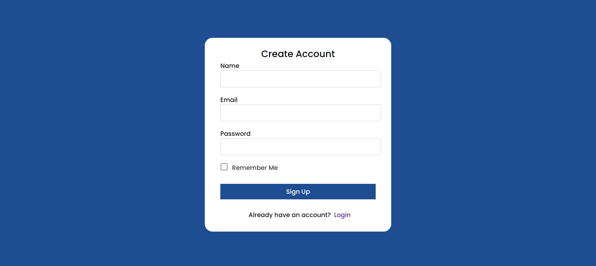
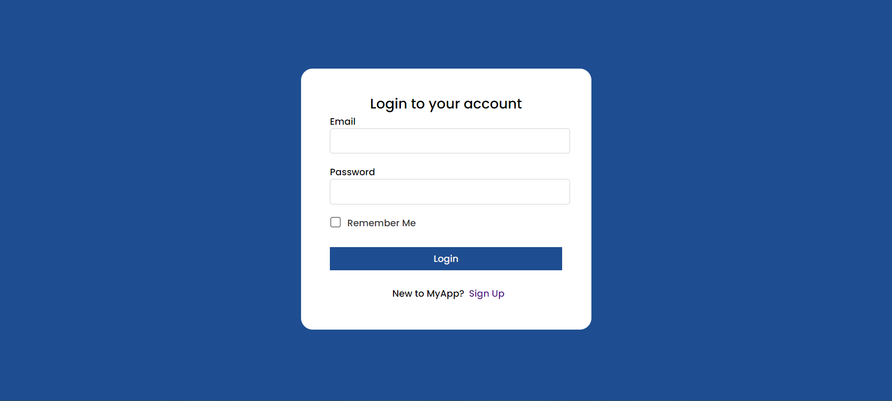
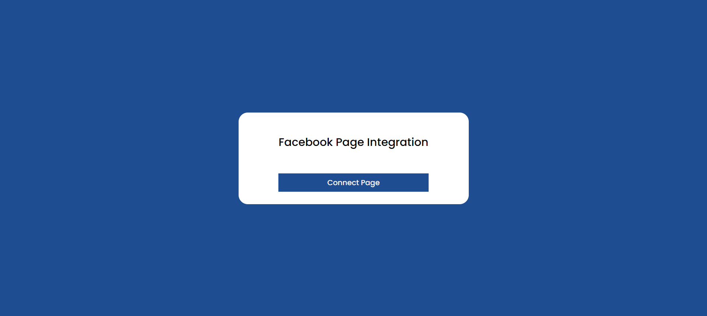

# RichPanel-Assignment

# FB Helpdesk Web Application

- This project is a Proof of Concept (POC) for a Facebook Helpdesk Web Application. It allows clients to connect their Facebook       
  accounts, listen to their messenger messages, and reply to them within the application. This application is designed to streamline the 
  process of managing and responding to customer messages on Facebook.

## Technologies Used

- Frontend: React.js
- Backend: Express.js, Node.js
- Database: MongoDB

### Features

- User Authentication: Users can register for a new account and log in using their credentials.

- Facebook Page Connection: Users can connect their Facebook Page to the application, allowing them to listen to messenger messages.

- Conversation Management: Messages from customers appear as conversations in the application. New conversations are created 
  automatically, and messages are grouped together based on the customer.

- Reply to Messages: Agents can reply to messages directly from the application, providing a seamless communication experience.

- Responsive UI: The user interface is designed to be user-friendly and responsive, ensuring a consistent experience across different 
  devices.

## Setup Instructions

1. Clone the repository:

   ```bash
 git clone <repository_url>
 
 2. Install dependencies for both client and server:

  cd client
  npm install

  cd ../server
  npm install

3.Set up MongoDB:

Ensure MongoDB is installed and running locally or update the connection string in the server configuration to connect to your MongoDB instance.

4.Configure Facebook Developer App:

-Follow the instructions in the Facebook for Developers documentation to create test users and obtain necessary credentials.

5.Start the server:

cd server
npm start

6.Start the client:

cd client
npm start

7.Open your browser and navigate to http://localhost:3000 to access the application.

  
## Screenshots of the App



